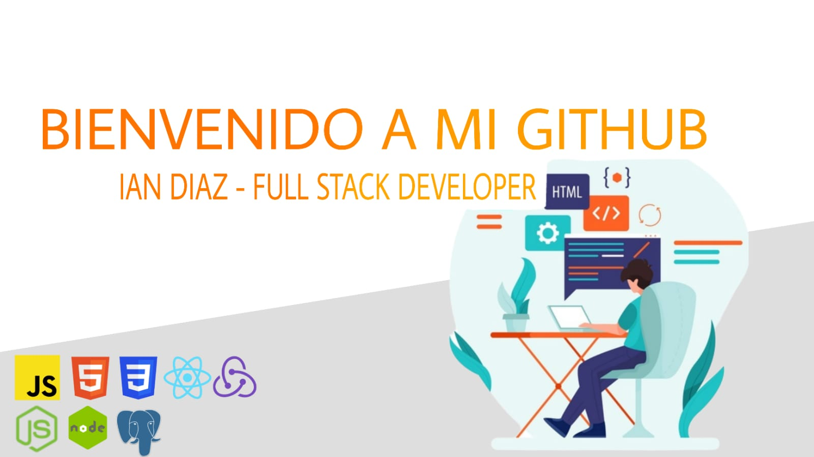

  

<h1 align="center">Hola 👋, Soy Ian Diaz</h1>
<h2 align="center">Full Stack Developer🚀</h2>

<h3 align="left">Visita mi linkedin:</h3>

<h3 align="left">Lenguajes y herramientas:</h3>

             

<h3>¿Quién Soy?🤔</h3>

👾 Soy un Full Stack Developer (Con orientación al Front-End) Con muchas ganas de mejorar y expandir mis conocimientos en el mundo IT.
Me encanta aprender siempre cosas nuevas y enfrentarme a desafíos que pongan a prueba mis conocimientos.

<h3>Experiencia🧠</h3>

👾 La mayor parte de mi experiencia fue en el ámbito académico. Fui a un secundario técnico, donde me recibí de técnico electrónico con orientación en la robotica y, actualmente estoy realizando el bootcamp de Soy Henry donde pude aprender herramientas muy poderosas como Java Script, React, Redux, Express, Node Js, Sequelize y CSS, además de desarrollar mis Soft skills, especialmente el trabajo en equipo, desarrollando varios proyectos.

<h2>Proyectos</h2>
<h2>Weather App</h2>

  
    

<h4>📲 Si quieres saber mas sobre mi Contáctame! :</h4>

💻Email: iandiaz270601@gmail.com

📞Tel: 11-6406 1078

<!--
**IanDiaz27/iandiaz27** is a ✨ _special_ ✨ repository because its `README.md` (this file) appears on your GitHub profile.

Here are some ideas to get you started:

- 🔭 I’m currently working on ...
- 🌱 I’m currently learning ...
- 👯 I’m looking to collaborate on ...
- 🤔 I’m looking for help with ...
- 💬 Ask me about ...
- 📫 How to reach me: ...
- 😄 Pronouns: ...
- ⚡ Fun fact: ...
-->
